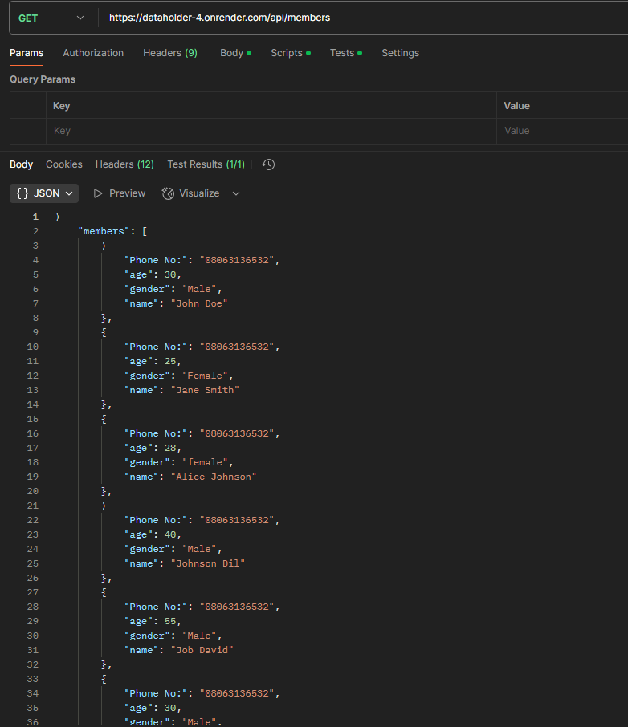
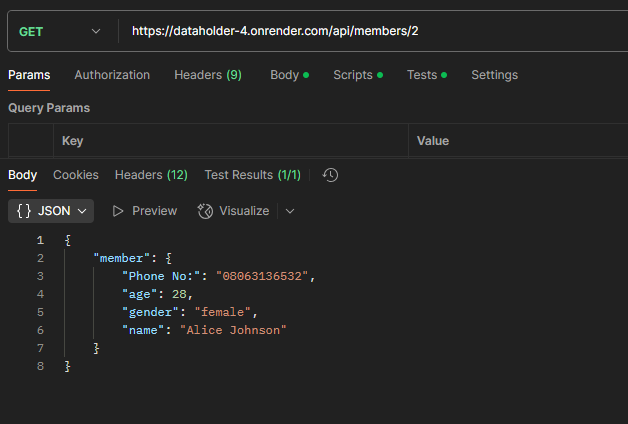
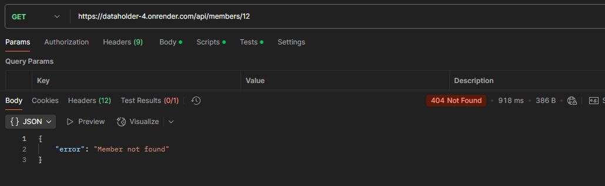
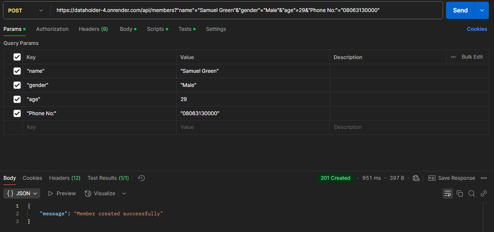

Flask CRUDd API for Member Management

This is a simple RESTful API built with Flask that allows you to manage a list of members.
The API supports basic CRUD operations: Create, Read, Update, and Delete

Setup & Run Instructions

1. Make sure you have Python and Flask installed:
   pip install flask

2. Ensure your project is structured like this:
   |-- dataholder/
   |-- **init**.py # Contains: 'from flask import Flask; app = Flask(**name**)'
   |-- route.py # The main API file that contains all the routes

Run the application:
python dataholder.py

API Endpoints

1. Get all members
   Endpoint: GET /api/members
   Description: Returns the list of all members.
   Response Using POSTMAN: 

2. Get a Single member
   Endpoint: GET /api/members/<int:member_id>
   Description: Retrieves a single member by index.
   Example: /api/members/2
   Response:
   Error(if index is out of range): 

3. Create a new member
   Endpoint: POST /api/members
   Description: Adds a new member to the list.
   Example:
